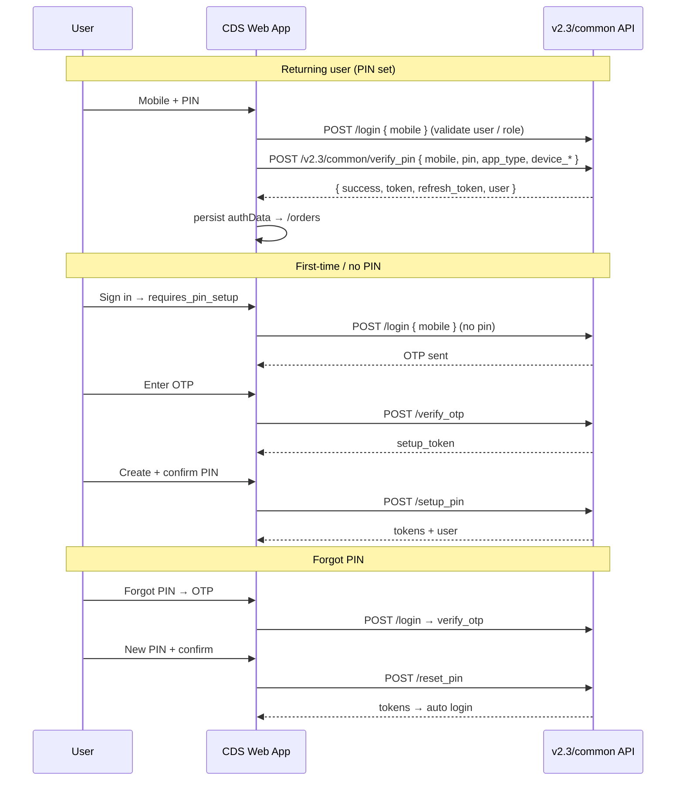

# PIN-Based Authentication (CDS Frontend + API Contract)

This Customer Display System app authenticates against MenuMitra `v2.3/common` APIs. PIN hashing, rate limits, and JWT issuance are **server-side** responsibilities.

## Flow diagram



## API endpoints (backend must implement)

| Method | Path | Purpose |
|--------|------|---------|
| POST | `/v2.3/common/login` | Validate mobile / OTP trigger when `pin` omitted |
| POST | `/v2.3/common/verify_pin` | **PIN login** — returns `access_token`, `user_id`, `expires_on`, etc. |
| POST | `/v2.3/common/verify_otp` | OTP verification; return `pin_setup_token` |
| POST | `/v2.3/common/setup_pin` | First-time PIN (requires `setup_token`) |
| POST | `/v2.3/common/reset_pin` | Forgot PIN (requires `setup_token`) |
| POST | `/v2.3/common/refresh_token` | Refresh access token |

### PIN login request

```json
{
  "mobile": "9876543210",
  "pin": "1234",
  "app_type": "cds",
  "version": "2.3.0",
  "device_id": "DEVICE123",
  "device_model": "Web Browser"
}
```

### Success response

```json
{
  "success": true,
  "message": "Login successful",
  "token": "jwt_access_token",
  "refresh_token": "jwt_refresh_token",
  "role": "owner",
  "user": { "id": 1, "name": "Admin User", "mobile": "9876543210" }
}
```

### Invalid PIN

```json
{
  "success": false,
  "message": "Invalid PIN",
  "attempts_remaining": 2
}
```

### Account locked (HTTP 423 optional)

```json
{
  "success": false,
  "message": "Account temporarily locked",
  "locked": true,
  "locked_until": "2026-05-30T12:00:00Z"
}
```

### No PIN yet

```json
{
  "success": false,
  "requires_pin_setup": true,
  "message": "PIN not set"
}
```

## Database migration (backend)

```sql
ALTER TABLE users
ADD COLUMN pin_hash VARCHAR(255),
ADD COLUMN failed_attempts INT DEFAULT 0,
ADD COLUMN locked_until TIMESTAMP NULL;
```

## Security checklist (backend)

- Hash PINs with bcrypt (cost ≥ 12) or Argon2id; never store plaintext
- Increment `failed_attempts` on bad PIN; reset on success
- Lock account after N failures (e.g. 5) for M minutes (e.g. 15)
- Rate-limit `/login`, `/verify_otp`, `/reset_pin` per IP + mobile
- Short-lived `pin_setup_token` after OTP (single use)
- JWT access + refresh rotation; honor `app_type` and `device_id`

## Frontend files

| File | Role |
|------|------|
| `src/services/authService.js` | API client, session persistence |
| `src/screens/Login.jsx` | Sign-in, setup, forgot PIN UI |
| `src/components/PinInput.jsx` | 4-digit PIN/OTP inputs |
| `src/utils/deviceUtils.js` | Stable `device_id`, remember mobile |
| `src/utils/sessionUtils.js` | Expiry + refresh helpers |
| `src/components/ProtectedRoute.jsx` | Guards routes with token refresh |

## Backward compatibility

- `authData.access_token` is always set (from `token` or `access_token` in API response)
- Legacy aliases: `sendOTP`, `resendOTP`, `verifyOTP` on `authService`
- OTP-only login removed from UI; OTP used only for setup / forgot PIN
